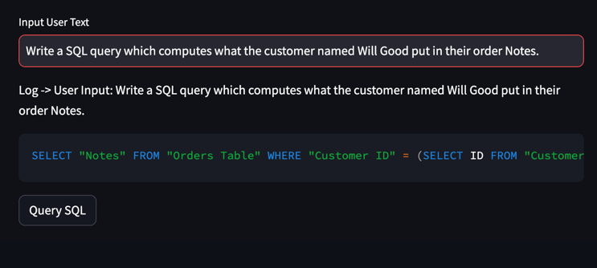
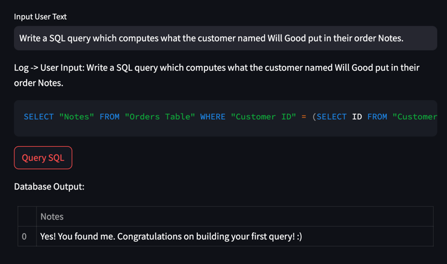

# GPT-to-SQL

- Initial exploration of the tables and processing of the DB(including transforming from the access DB to the Excel to then the SQL DB) is in the processing_and_util_methods.ipynb file

- I made a streamlit front end representation for this Assignment, and tied the GPT prompt generation and the sql command execution within the application

- 
- 
